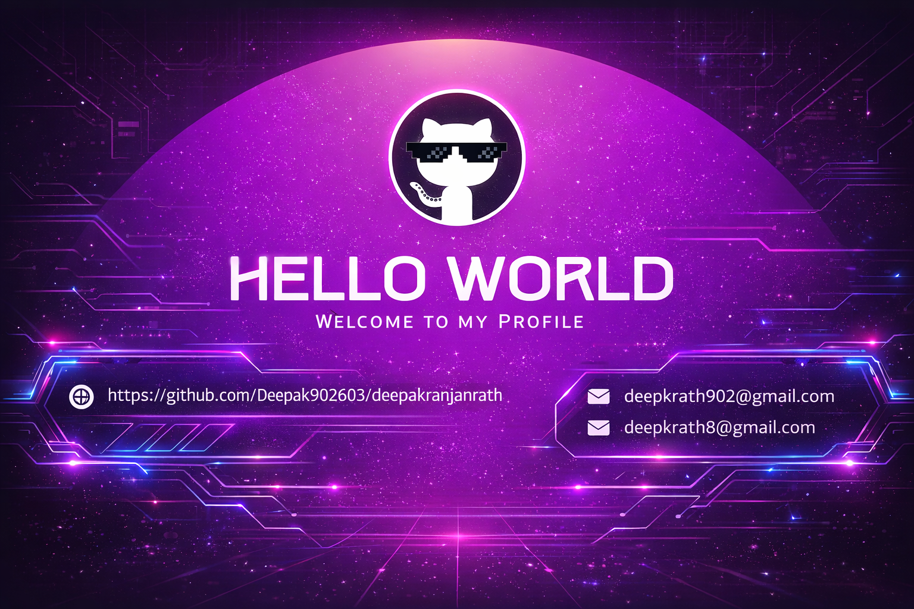

<!-- ===================== -->
<!--        BANNER        -->
<!-- ===================== -->

<!-- ===================== -->
<!--     INTRO SECTION    -->
<!-- ===================== -->
<table width="100%">
<tr>

<td width="65%" valign="top">

# 👋 Hi, I'm Deepak Ranjan Rath  
### 💻 Software Developer | Full Stack Learner | ML Enthusiast  

I am a passionate **Software Developer** with hands-on experience in  
**Java, JavaScript, React, MongoDB, and Machine Learning**.  
I enjoy building real-world projects and continuously improving my  
**problem-solving and backend skills**.

---

## 🚀 About Me
- 🎓 MCA Graduate (**GIFT Autonomous, Bhubaneswar**)
- 💼 Former Intern at **Samsung Pvt. Ltd.**
- 🌱 Currently learning **Backend Development & System Design**
- 🔥 Interested in **React, Node.js, MongoDB & AI**
- 💡 Love building scalable and clean applications

</td>

<td width="35%" valign="top" align="center">

</td>

</tr>
</table>

---

## 👀 Profile Views

  

---

## 🛠 Tech Stack

  

---

## 📊 GitHub Stats

  
  

---

## 🧠 Top Languages

  

---

## 📈 Contribution Graph

  

---

## ✨ Thought of the Day

<!--STARTS_HERE_QUOTE_CARD-->

  

<!--ENDS_HERE_QUOTE_CARD-->

---

## 🤝 Connect With Me

---

  

